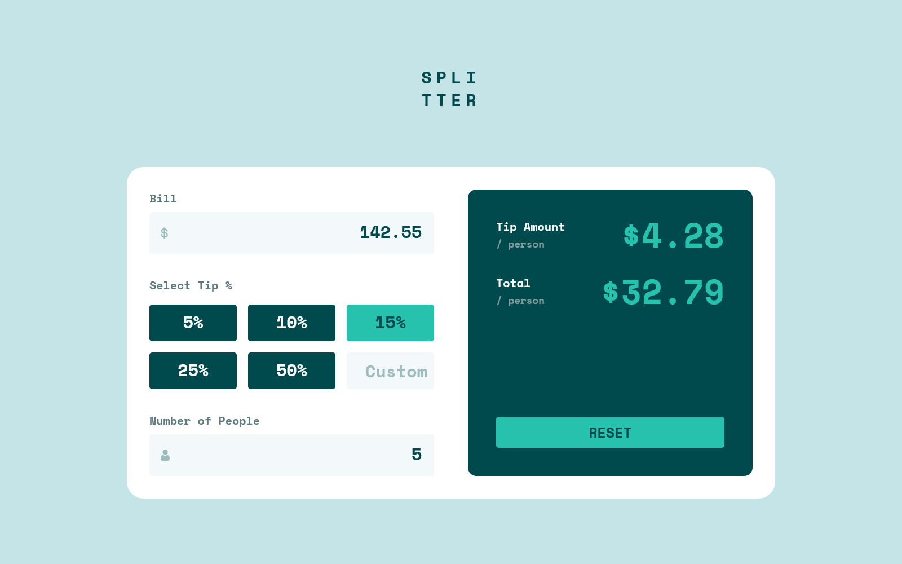

# Tip calculator

[](https://app.netlify.com/projects/javieer57-tip-calculator/deploys)

This is a solution to the [Tip calculator app challenge on Frontend Mentor](https://www.frontendmentor.io/challenges/tip-calculator-app-ugJNGbJUX). Frontend Mentor challenges help you improve your coding skills by building realistic projects.

## Screenshot



## The challenge

Users should be able to:

- View the optimal layout for the app depending on their device's screen size
- See hover states for all interactive elements on the page
- Calculate the correct tip and total cost of the bill per person

## Links

- Solution: [Tip calculator app (React, Vite, Typescript, Tailwind)](https://www.frontendmentor.io/solutions/tip-calculator-app-react-vite-typescript-tailwind-AmF7guhBmS)
- Site: [https://javieer57-tip-calculator.netlify.app/](https://javieer57-tip-calculator.netlify.app/)

## Build with

- [Vite](https://es.react.dev/)
- [React](https://es.react.dev/)
- [Typescript](https://www.typescriptlang.org/)
- [Redux Toolkit](https://redux-toolkit.js.org/)
- [TailwindCSS](https://tailwindcss.com/)
- Semantic HTML
- Keyboard navigation

## State Management with RTK

The application state is managed using a simple structure, as shown below.

```typescript
export interface CalculatorState {
  bill: string;
  people: string;
  tip: {
    current: string;
    custom: string;
    selected: string;
  };
  tipAmount: number;
  totalPerPerson: number;
}

export const initialState: CalculatorState = {
  bill: "",
  people: "",
  tip: {
    current: "",
    custom: "",
    selected: "",
  },
  tipAmount: 0,
  totalPerPerson: 0,
};
```

Most fields use strings to simplify handling the calculator inputs, since number types would display a default '0' in the text fields.

## Author

- Frontend Mentor - [@Javieer57](https://www.frontendmentor.io/profile/Javieer57)
- Codepen - [@e_javieer](https://codepen.io/e_javieer)
